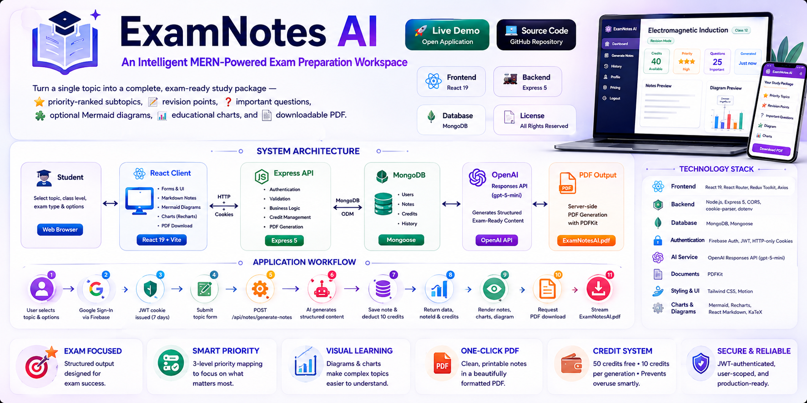
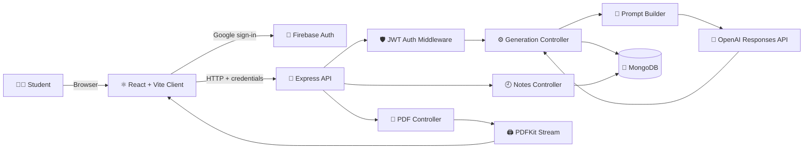
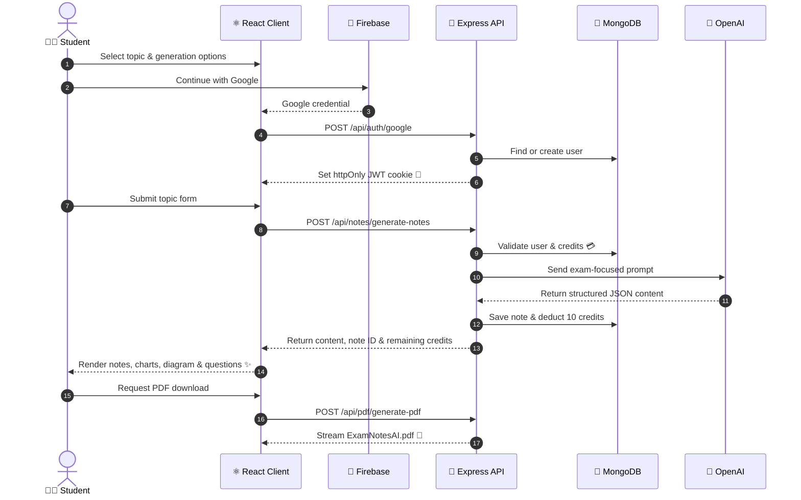

<div align="center">

# 📚 ExamNotes AI

### 🧠 An Intelligent MERN-Powered Exam Preparation Workspace

Turn a single topic into a complete, exam-ready study package — ⭐ priority-ranked subtopics, 📝 revision points, ❓ important questions, 🧩 optional Mermaid diagrams, 📊 educational charts, and a 📄 downloadable PDF.

[](https://mern-ai-exam-helper-client.onrender.com)
[](https://github.com/paras160500/MERN-AI-Exam-Helper)
[](./client)
[](./server)
[](https://www.mongodb.com/)
[](#-license)

**[🌐 Launch the Live Application](https://mern-ai-exam-helper-client.onrender.com)** &nbsp;·&nbsp; **[⭐ Star the Repo](https://github.com/paras160500/MERN-AI-Exam-Helper)**

</div>

<br>



## 📖 Table of Contents

<table>
<tr>
<td valign="top" width="33%">

**🧭 Getting Oriented**
- [✨ Overview](#-overview)
- [💡 Why ExamNotes AI](#-why-examnotes-ai)
- [🧩 Feature Matrix](#-feature-matrix)
- [🏗️ Architecture](#️-architecture)
- [🔄 Application Workflow](#-application-workflow)

</td>
<td valign="top" width="33%">

**🛠️ Building It**
- [⚙️ Technology Stack](#️-technology-stack)
- [📂 Project Structure](#-project-structure)
- [🚀 Getting Started](#-getting-started)
- [🔑 Environment Variables](#-environment-variables)

</td>
<td valign="top" width="33%">

**📡 Using It**
- [📡 API Reference](#-api-reference)
- [🤖 AI Response Contract](#-ai-response-contract)
- [💳 Credit Model](#-credit-model)
- [🔒 Security Notes](#-security--engineering-notes)
- [☁️ Deployment](#️-deployment)
- [🗺️ Roadmap](#️-roadmap)
- [🤝 Contributing](#-contributing)

</td>
</tr>
</table>

---

## ✨ Overview

**ExamNotes AI** is a full-stack study assistant that transforms a learner's topic, class level, and exam context into a focused revision package. It combines a ⚛️ **React** interface with an 🚂 **Express** API, 🍃 **MongoDB** persistence, 🔐 **Google authentication** via Firebase, and 🤖 **OpenAI-powered** content generation.

Instead of returning an unstructured wall of text, the system asks the AI to produce a predictable, structured educational document — complete with:

| 📦 | Included in every generation |
|:---:|---|
| 📝 | Detailed Markdown notes |
| ⭐ | Three levels of topic priority |
| ⏱️ | Last-minute revision points |
| ❓ | Short & long exam questions |
| 🧩 | A relevant diagram prompt |
| 📊 | Ready-to-render chart data |

Students can revisit saved notes from their **history** 🕘 or export any generated result as a polished **`ExamNotesAI.pdf`** 📄.

> 🔗 **Live application:** [mern-ai-exam-helper-client.onrender.com](https://mern-ai-exam-helper-client.onrender.com)

---

## 💡 Why ExamNotes AI

Exam prep is often slowed down by 🌪️ scattered resources, 📚 overly broad explanations, and the struggle to figure out **what actually deserves attention first**.

ExamNotes AI solves this by unifying:

`🎯 Topic selection` → `🧱 Structured generation` → `🖼️ Visual learning` → `🔁 Revision` → `🕘 History` → `📄 Export`

...into one focused experience. The project is intentionally built around an **exam-oriented output model** rather than a generic chatbot response — the prompt builder keeps subtopics, notes, revision points, questions, diagrams, and charts as **separate responsibilities**, so each section renders independently on the frontend.

---

## 🧩 Feature Matrix

| Capability | What It Provides | Primary Implementation |
|---|---|---|
| 🔐 Google Sign-In | Authentication without maintaining a local password flow | Firebase client + JWT cookie session |
| 🤖 AI Note Generation | Structured notes based on topic, class level, exam type & revision mode | OpenAI Responses API (`gpt-5-mini`) |
| ⭐ Priority Mapping | Three educational priority tiers for fast planning | Structured JSON response contract |
| 🔁 Revision Mode | A concise, high-value final review layer | Prompt builder + revision renderer |
| 🖼️ Visual Learning | Optional Mermaid diagrams + Recharts-compatible chart data | `mermaid`, `recharts` |
| 🕘 Notes History | Browse previously generated notes, newest first | MongoDB `Notes` model + protected routes |
| 🔍 Note Detail View | Re-open the full saved result for any note | User-scoped note lookup |
| 📄 PDF Export | Download a clean, printable study document | Server-side PDFKit stream |
| 💳 Credit Control | Prevents generation once credits run out | User credit balance + availability flag |
| 📱 Responsive Shell | Navigation, sidebar, topic form, results, pricing & history | React Router + Tailwind CSS |

---

## 🏗️ Architecture

The system follows a conventional full-stack separation: the client owns interaction, the server owns logic, MongoDB owns state, and the AI provider generates content.



### 🧱 Runtime Boundaries

| Boundary | Responsibility | Notes |
|---|---|---|
| 🖥️ Client | Forms, routing, state, Markdown, diagrams, charts, downloads | Axios with credentialed requests |
| 🔐 Authentication | Identity & session establishment | Firebase → server issues a 7-day JWT cookie |
| 🚂 API | Validation, authorization, orchestration, persistence | Protected routes require the `token` cookie |
| 🤖 AI Service | Converts a prompt into a structured learning package | Server parses model output as JSON |
| 🍃 Data Layer | Stores users, credits, note metadata & content | Mongoose schemas |
| 📄 Export Layer | Converts generated content into a PDF response | Streamed directly to the client |

---

## 🔄 Application Workflow



---

## ⚙️ Technology Stack

<table>
<tr><th>Layer</th><th>Technologies</th></tr>
<tr><td>🖥️ Frontend</td><td>React 19 · Vite · React Router · Redux Toolkit · Axios</td></tr>
<tr><td>🎨 Styling & Motion</td><td>Tailwind CSS · Motion · Custom CSS</td></tr>
<tr><td>🖼️ Rendering</td><td>React Markdown · Remark Math · Rehype KaTeX · Mermaid · Recharts</td></tr>
<tr><td>🔐 Authentication</td><td>Firebase Authentication · JSON Web Tokens · HTTP-only Cookies</td></tr>
<tr><td>🚂 Backend</td><td>Node.js · Express 5 · cookie-parser · CORS · dotenv</td></tr>
<tr><td>🍃 Persistence</td><td>MongoDB · Mongoose</td></tr>
<tr><td>🤖 AI</td><td>OpenAI Node SDK · Responses API (<code>gpt-5-mini</code>)</td></tr>
<tr><td>📄 Documents</td><td>PDFKit</td></tr>
<tr><td>☁️ Deployment</td><td>Render-compatible client & server configuration</td></tr>
</table>

---

## 📂 Project Structure

```
MERN-AI-Exam-Helper/
├── client/
│   ├── src/
│   │   ├── assets/                 # 🎨 Branding & application imagery
│   │   ├── components/             # 🧩 Navbar, sidebar, forms, charts, diagrams, results
│   │   ├── pages/                  # 📄 Home, auth, notes, history, pricing
│   │   ├── redux/                  # 🗃️ Store & user state
│   │   ├── services/               # 🌐 Axios API client & request helpers
│   │   ├── utils/                  # 🔧 Firebase configuration
│   │   ├── App.jsx                 # 🧭 Application routes & shell
│   │   └── main.jsx                # 🚪 React entry point
│   ├── package.json
│   └── vite.config.js
├── server/
│   ├── controllers/                # 🧠 Auth, generation, notes, user & PDF logic
│   ├── middlewares/                # 🛡️ JWT authentication middleware
│   ├── models/                     # 🍃 User & Notes Mongoose schemas
│   ├── routes/                     # 🛣️ Auth, notes, user & PDF endpoints
│   ├── services/                   # 🤖 OpenAI integration
│   ├── utils/                      # 🔧 DB connection, prompts & token helpers
│   ├── index.js                    # 🚪 Express application entry point
│   └── package.json
├── .gitignore
└── README.md
```

---

## 🚀 Getting Started

### ✅ Prerequisites

| Requirement | Recommended Version | Purpose |
|---|---|---|
| 🟢 Node.js | 18+ | Runs the client & server |
| 📦 npm | Bundled with Node.js | Installs dependencies & runs scripts |
| 🍃 MongoDB | Atlas or local instance | Persists users & generated notes |
| 🔐 Firebase project | Google provider enabled | Handles Google authentication |
| 🤖 OpenAI API key | Active key with model access | Generates structured study content |

### 1️⃣ Clone the repository

```bash
git clone https://github.com/paras160500/MERN-AI-Exam-Helper.git
cd MERN-AI-Exam-Helper
```

### 2️⃣ Install dependencies

```bash
cd server
npm install

cd ../client
npm install
```

### 3️⃣ Configure the server

Create `server/.env` using the [environment variables](#-environment-variables) reference below.

### 4️⃣ Configure the client

Create the client environment file expected by the Firebase utility and API service.

> ⚠️ **Note:** Keep Firebase config values in the client only when they're intended to be public web-app config. **Never** expose the server JWT secret or OpenAI key in the client bundle.

### 5️⃣ Run both applications

**Terminal 1 — Server**
```bash
cd server
npm run dev
```

**Terminal 2 — Client**
```bash
cd client
npm run dev
```

🌐 Open the Vite URL shown in the terminal — usually `http://localhost:5173`.

### 📜 Available Scripts

| Directory | Command | Purpose |
|---|---|---|
| `client` | `npm run dev` | 🖥️ Start the Vite development server |
| `client` | `npm run build` | 🏗️ Create a production client build |
| `client` | `npm run preview` | 👀 Preview the production build locally |
| `client` | `npm run lint` | 🧹 Run ESLint checks |
| `server` | `npm run dev` | 🚂 Start the API with Nodemon |
| `server` | `npm start` | ▶️ Start the API in production mode |

---

## 🔑 Environment Variables

### 🚂 Server — `server/.env`

```env
PORT=5000
MONGO_URI=mongodb+srv://<username>:<password>@<cluster>/<database>
OPENAI_API=<your-openai-api-key>
JWT_SECRET=<long-random-secret>
CLIENT_URL=http://localhost:5173
```

> 🌍 The current server CORS configuration allows the deployed client origin `https://mern-ai-exam-helper-client.onrender.com` and enables credentialed requests. When running a local client, update that origin in `server/index.js` or make it configurable via environment variable. In production, always use HTTPS and a strong, randomly generated `JWT_SECRET`.

### 🖥️ Client Environment

The client reads the Firebase API key from Vite environment variables, while the remaining Firebase web config lives in `client/src/utils/firebase.js`. The Axios service currently points to the deployed API URL in `client/src/App.jsx` — replace it with your local API URL for local development.

```env
VITE_FIREBASE_API=<firebase-web-api-key>
```

> 🚫 **Important:** Never commit `.env` files. The OpenAI API key and JWT secret belong **exclusively** on the server.

---

## 📡 API Reference

All protected endpoints require the JWT session cookie issued at Google authentication. The API is mounted under `/api`.

| Method | Endpoint | Auth | Description |
|:---:|---|:---:|---|
| `POST` | `/api/auth/google` | 🌐 Public | Find or create a user from Google profile data & issue a JWT cookie |
| `GET` | `/api/auth/logout` | 🌐 Public | Clear the authentication cookie |
| `GET` | `/api/user/currentuser` | 🔒 Required | Return the authenticated user record |
| `POST` | `/api/notes/generate-notes` | 🔒 Required | Generate, persist & return AI exam notes |
| `GET` | `/api/notes/getnotes` | 🔒 Required | Return the authenticated user's note history |
| `GET` | `/api/notes/:id` | 🔒 Required | Return one note belonging to the authenticated user |
| `POST` | `/api/pdf/generate-pdf` | 🔒 Required | Generate & stream a PDF from a result object |

### ✍️ Generate Notes — Request

```json
{
  "topic": "Electromagnetic induction",
  "classLevel": "Class 12",
  "examType": "Board examination",
  "revisionMode": true,
  "includeDiagram": true,
  "includeChart": true
}
```

✅ A successful generation response includes the generated `data`, the saved `noteId`, and the user's remaining `credits`.

---

## 🤖 AI Response Contract

The prompt builder is designed around a **stable JSON shape** so the frontend can render each educational section independently.

```json
{
  "importance": "⭐",
  "subTopics": {
    "⭐": ["Most important subtopic"],
    "⭐⭐": ["Important subtopic"],
    "⭐⭐⭐": ["High-yield subtopic"]
  },
  "notes": "# Exam-ready Markdown notes...",
  "revisionPoints": ["Concise revision fact"],
  "questions": {
    "short": ["Short-answer question"],
    "long": ["Long-answer question"],
    "diagram": "Diagram-based question"
  },
  "diagram": {
    "type": "flowchart",
    "data": "graph TD; A[Concept] --> B[Relationship]"
  },
  "charts": [
    {
      "type": "bar",
      "title": "Educational comparison",
      "data": [{ "name": "Example", "value": 10 }]
    }
  ]
}
```

💡 `diagram.data` is consumed by **Mermaid**; chart items feed **Recharts**-compatible visualizations. If a chart or diagram isn't educationally meaningful for a topic, the generator can return an empty value or array.

---

## 💳 Credit Model

Each successful note generation consumes **10 credits** 🔻. New users start with **50 credits** 🎉 — good for five initial generations. The server checks the balance *before* calling the AI service, persists the note only after generation succeeds, then deducts credits and updates availability.

| Event | Credit Effect |
|---|:---:|
| 🆕 New user created | `+50` |
| ✅ Successful note generation | `-10` |
| ⚠️ Fewer than 10 credits | 🚫 Generation blocked |
| 🪫 Balance reaches zero | `isCreditAvailable → false` |

---

## 🔒 Security & Engineering Notes

🛡️ Authentication is enforced server-side via the `isAuth` middleware, which reads and verifies the JWT from the `token` cookie before any protected operation can touch user data. Note lookups are scoped by **both** note ID and authenticated user ID — preventing one signed-in user from retrieving another user's saved note through the normal API path.

### 🏭 For Production Hardening

- 🌐 Configure strict CORS origins
- 🧼 Validate & sanitize all request payloads
- ⏱️ Add rate limiting around generation
- 🙈 Avoid returning raw internal errors
- 🧪 Add automated tests
- ⚛️ Consider an atomic credit-decrement strategy to prevent race conditions on concurrent requests

---

## ☁️ Deployment

The project suits a **split deployment** — client and server as separate services. Point the client's API base URL at the deployed server, configure the server's CORS allowlist for the deployed client origin, and ensure cookie attributes stay compatible with HTTPS and cross-origin requests.

### 🌐 Live Deployment

| Service | URL |
|---|---|
| 🖥️ Client Application | [mern-ai-exam-helper-client.onrender.com](https://mern-ai-exam-helper-client.onrender.com) |
| 💻 Source Repository | [github.com/paras160500/MERN-AI-Exam-Helper](https://github.com/paras160500/MERN-AI-Exam-Helper) |

### ✅ Production Checklist

- [ ] 🔐 Set all server secrets in the hosting provider's environment configuration
- [ ] 🌍 Use the deployed client URL in the server CORS configuration
- [ ] 🔗 Use the deployed API URL in the client Axios service (currently `https://ai-exam-helper-server.onrender.com`)
- [ ] ⚙️ Replace the hard-coded CORS origin with an environment-driven allowlist
- [ ] 🔐 Add the production domain to Firebase authorized domains
- [ ] 🍃 Verify MongoDB Atlas network access & database credentials
- [ ] 🍪 Confirm HTTPS cookie behavior across client & API domains
- [ ] 🏗️ Run `npm run build` in the client before serving the production bundle

---

## 🗺️ Roadmap

- 📡 Streaming generation
- 🔍 Topic search & filtering
- 🗑️ Note deletion & 🔁 regeneration
- 🃏 Spaced-repetition flashcards
- 🧪 Quiz scoring
- 📈 Analytics dashboards
- ⚡ Optimistic credit updates
- 🧬 Request validation with a schema library
- 🤖 Automated API tests
- 👑 Role-based administration for plans & credits

---

## 🤝 Contributing

Contributions are welcome! 🎉 Create a feature branch, keep changes focused, run the client lint and build checks, and describe the user-facing impact in your pull request. For substantial changes, please include an updated API example or architecture note so the docs stay in sync with the implementation.

```bash
git checkout -b feature/your-improvement
# make your changes ✨
cd client && npm run lint && npm run build
git add .
git commit -m "feat: describe your improvement"
git push origin feature/your-improvement
```

---

## 📄 License

No explicit open-source license is currently declared in this repository. Until a license is added, the source should be treated as **all rights reserved** 🔒 and reused only with the author's permission.

---

## 📚 References

| # | Resource |
|:---:|---|
| 1 | [MERN AI Exam Helper — Source Repository](https://github.com/paras160500/MERN-AI-Exam-Helper) |
| 2 | [ExamNotes AI — Live Application](https://mern-ai-exam-helper-client.onrender.com) |
| 3 | [React Documentation](https://react.dev/) |
| 4 | [Express Documentation](https://expressjs.com/) |
| 5 | [OpenAI Responses API Documentation](https://platform.openai.com/docs/api-reference/responses) |
| 6 | [MongoDB Documentation](https://www.mongodb.com/docs/) |
| 7 | [Mermaid Documentation](https://mermaid.js.org/) |
| 8 | [Firebase Authentication Documentation](https://firebase.google.com/docs/auth) |

<div align="center">

---

### 🎓 Built for focused, structured, and exam-ready learning.

⭐ **If this project helped you, consider starring the repo!** ⭐

</div>
